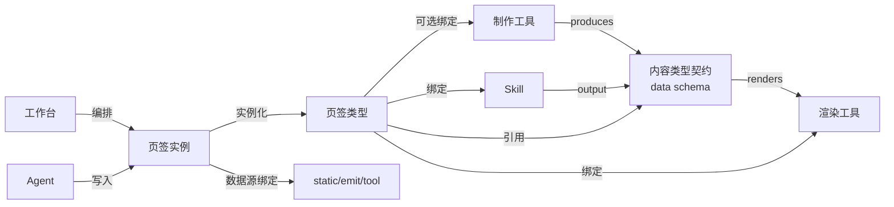

# Workbench Studio：可组装 / 即时开发的 AI 原生工作台平台 方案

> 状态：产品 + 架构方案（**第十一节 4 个关键决策已采纳推荐默认值定稿**），**未进入开发**。
> 定位：`docs/ai-response-display-and-workspace-platform-plan.md` 中"§4 工作区平台化 + §6 三层开放 + §7 Agent 编排"的**具体化、解耦化与容器化延伸**。
> 一句话总纲：把右侧工作区从"写死的功能页"升级为**可组装、可即时开发、可容器化托管的工作台操作系统**——用平台的 AI 会话底座当内核，让用户拼装甚至现场开发出自己的 skill 工作台 / 测试工作台 / 设计工作台等各行业工作台。

---

## 0. 要解决的本质

把当前耦合在一起的"页签 = 渲染 = 数据 = skill"拆成互相独立、可各自增长、又能自由关联的模块；关联不靠硬编码，而靠一套**"内容类型契约"中枢**（类似编程语言的类型系统：谁能生产什么、谁能渲染什么，自动匹配）。最终用户通过"选已有 + 现场开发缺的"拼出任意领域工作台。

核心原则（继承既有方案）：**展示放开、写回收紧；渲染放开自由度、逻辑与写回收紧管控；配置优先、沙箱次之、官方扩展兜底；首期可落地、服务稳定不失控。**

---

## 1. 彻底解耦的 7 个一等公民

| 对象 | 定义 | 类比 |
|---|---|---|
| **内容类型 Content Type** | 一类可加载/呈现素材的**数据契约**（JSON Schema + 格式声明 + 样例）。如 `html-page`、`drawio-diagram`、`mindmap`、`table`、`chart`、`doc`、`kanban`、`clarification`、`prototype`、`code-bundle`… | 数据的"类型" |
| **渲染工具 Render Tool** | 声明"我能渲染哪些内容类型"，给出交付方式（内置原语 / iframe URL / Web Component / 容器服务） | 类型的"消费者" |
| **制作工具 Authoring Tool** | 声明"我能生产哪些内容类型"，通过 MCP / skill / 外部工具接入（如 draw.io 画布既渲染也制作） | 类型的"生产者" |
| **Skill** | 会话中产出结果，声明 `output = 某内容类型`（扩展现有 `CapabilityExecution.output_payload.type`） | 一次性生产者 |
| **页签类型 Tab Type** | **模板/蓝图** = 内容类型 + 渲染工具 +（可选）制作工具 + 绑定 skill + 动作 + 数据供给模式；可复用、可分享 | "类 class" |
| **页签实例 Tab Instance** | 由某页签类型实例化的具体面板 = 页签类型 + 数据源绑定 + 工作区位置 | "对象 object" |
| **工作台 Workspace** | 一组页签实例的编排布局，可存为模板分享 | 应用 |

Agent 不是新增对象，而是**编排者**：串联 skill、把产出写进指定页签实例（数据总线）、定义步骤流转（沿用"页签即数据总线"）。

---

## 2. 关系机制：以"内容类型契约"为中枢的能力匹配

一切通过**内容类型**协商，模块之间不直接依赖：

**匹配规则（校验时验证 + 运行时兜底）**：页签类型合法 ⇔ `渲染工具.renders ∋ 内容类型` 且 `制作工具.produces ∋ 内容类型` 且 `绑定skill.output` 与内容类型兼容。校验不过 → 允许保存但降级为"通用产物 + 待审核 draft"（沿用既有边界策略）。

**解耦收益**：
- 换渲染工具不动 skill；一个内容类型被多个页签类型复用。
- **别人复用你的页签类型**：新建页签实例指向该类型、绑自己数据源即可。
- **接入新工具**：注册它 `renders/produces` 哪些内容类型，立即可被任意页签类型选用。

---

## 3. 承载各项内容的列表页（注册表 / 市场）

1. **内容类型注册表** —— 按分类浏览（页面类 / 图形画布类 / 脑图类 / 表格类 / 文档类 / 看板类…），看 schema、样例、被谁生产/渲染。
2. **工具市场** —— 渲染工具 + 制作工具 + MCP 接入。标注每个工具 `renders/produces` 的内容类型、交付方式、运行时形态。
3. **页签类型市场** —— 已开发好的页签类型清单（官方预置 + 用户自建 + 他人分享），"用此类型新建我的页签"。（即"页签列表供选择"）
4. **Skill 库**（现有，扩展 output 内容类型字段）。
5. **Agent 库** —— 编排定义。
6. **我的页签实例** —— 已实例化并配好数据源的页签。
7. **我的工作台** —— 编排布局，可另存为模板。
8. **运行时/部署面板** —— 容器化页签服务启停、健康、日志。

外加 **AI 开发控制台**：会话式开发页签类型。

---

## 4. 右侧工作区 = 工作台组装器

- 从"页签类型市场"选类型 → 生成页签实例 → 绑数据源（static 导入 / emit 会话产出 / tool 工具驱动）→ 拖拽排序、分栏、保存布局。
- 每个页签实例都可**在 AI 会话区对它单独工作**（会话 ↔ 当前聚焦页签实例上下文绑定）。
- 工作台可存为模板 → 一键复刻。**skill 工作台 / 测试工作台 / 设计工作台 = 预置特定页签类型组合的工作台模板**，用本系统自造（dogfooding）。

---

## 5. 页签类型的三种运行时形态（容器化策略）

- **A 类 · 壳内渲染（0 容器）**：L1 配置类页签，用平台内置渲染原语（表格/脑图/图表/文档/静态 html/澄清/看板）。覆盖 ~90%，不需容器。
- **B 类 · 工具后端（共享容器）**：绑定外部工具/MCP（draw.io 等）。工具作为**长驻多租户服务**，页签只连接。
- **C 类 · 自研页签类型服务（容器化）**：会话式开发出来、自带前端包 +（可选）后端的页签类型。codex cli 打成镜像、注册版本、发布上架。

---

## 6. 会话式开发页签类型 → codex 容器化部署流水线

1. AI 开发控制台起会话 → codex cli 在独立容器工作区生成页签类型代码（前端组件 + 可选后端 + `tabtype.manifest.json` 声明内容类型/工具/skill/动作契约）。
2. 平台构建镜像 → 产出"页签类型版本"（manifest 契约自洽校验；不过则降级为待审核 draft）。
3. 发布到"页签类型市场"。用户在工作台添加该类型页签、绑好预设工具后，**平台按需 `docker` 启动服务**，网关注册路由，页签即可用。

复用：现有 codex/claude runtime、AI 会话工作区治理 skill、`output_payload.type` 路由、runtime auth token 模式。

---

## 7. 页签 ↔ 平台通讯机制（Tab SDK + 网关 + 数据总线）

- **Tab SDK（前端）**：iframe/组件通过 `postMessage` 与平台壳桥接（生命周期、聚焦、请求数据、投递产出、订阅事件）。
- **Tab SDK（后端）**：容器服务向平台注册（instance_id、健康、能力），用**带作用域签名 token**（复用 runtime auth 模式，仅授权本实例可访问数据）调平台 API。
- **网关/反向代理**：`/tabs/<instance_id>/...` 路由到对应容器；统一鉴权、限流、审计。
- **数据总线**：即"页签即数据总线"跨容器版 = **平台中介的 API/WebSocket**；页签产出落绑定数据槽，Agent/其他页签按契约读取。线性编排天然无并发写；DAG 阶段再引版本/分区/合并。

---

## 8. 治理与安全（复用 L1/L2/L3 + 容器隔离）

- L1 配置层（人人可用/0 风险）→ L2 沙箱脚本层（审核/强隔离）→ L3 官方扩展层（认证开发者/上架审查）。
- 容器隔离 + 资源配额 + 网络白名单 + token 最小权限 + 版本化。
- **写回核心业务表仍收紧**（自研页签默认禁用或强确认 + 来源标记）；展示放开、写回收紧不变。

---

## 9. 落地路线（分期）

- **P0 模型化**：落 DB 对象模型 + 注册表，把现有 ~18 个硬编码 tab 迁成"页签类型定义"（仅 A 类，无容器）。
- **P1 组装器**：工作台编排（选/排/存）+ 内容类型注册表 + 内置渲染原语 + 数据总线（进程内）。
- **P2 工具接入**：工具市场 + MCP 后端页签（B 类）+ 制作工具。
- **P3 会话式开发 + 容器化**：AI 开发控制台 + codex 构建流水线 + C 类多租户运行时 + 网关 + Tab SDK。
- **P4 生态复用**：市场分享/复用 + Agent 编排绑定 + 工作台模板（用本系统造出 skill/测试/设计工作台，自证闭环）。
- **P5 强隔离与规模化**：独占容器 / scale-to-zero / 安全治理硬化 / 开发者生态。

---

## 10. 与既有平台/代码的衔接（现状事实）

| 现有能力 | 代码位置 | 迁移到新模型 |
|---|---|---|
| 官方 skill → 固定页签路由 | `new_project_runtime.py` 的 `target_workspace_tab`（project/clarification/baselineRequirementAnalysis/prototypeRequirementAnalysis…） | 变为"页签类型 + 内容类型契约"的预置定义 |
| 会话类型 → 页签+能力映射 | `AIProductCreate.vue` `sessionTypeConfig`（workspaceTab + capabilityCodes） | 变为可视化 Agent 编排 |
| 全链路工作流 | `flow_runtime.py` `flow_ai_dev_full_cycle`（10+ 步硬编码） | 变为 Agent 步骤序列（首期线性 + 人工卡点） |
| 右侧 ~18 个页签 | `AIDevConversationWorkspace.vue`（~24600 行） | 逐个迁为页签类型定义 |
| 接受写回核心表 | `accept_requirement_analysis` 等 `select_for_update`+事务 | 收敛为页签"动作"，写回受权限/review 管控 |

---

## 11. 关键决策（已采纳推荐默认值定稿）

1. **容器粒度**：默认 = **每"页签类型(版本)"一个多租户服务，多实例共享**；重/有状态/L2 沙箱场景可 opt-in 升级为每工作台/每实例独占容器，支持 scale-to-zero。
2. **前端集成**：默认 = **iframe（隔离优先，契合容器模型）**；追求深度 UI 融合的官方 L3 组件可选 Module Federation。
3. **页签状态归属**：默认 = **一律使用平台托管存储**（页签服务不自持 DB/状态），便于治理、迁移、备份与多租户。
4. **数据总线传输**：默认 = **平台中介的 API/WebSocket**（安全、可审计），不允许页签间直连。

---

## 12. 用新规则重装现有 AI 研发全链路的可行性结论

见 memory `workbench-studio-composable-platform.md` 与本节：现有 9 个环节页签（项目澄清/需求澄清/需求分析/原型设计/测试设计/设计选型/开发实现/代码展示/上传文件）在新模型下均可表达为"页签类型 + 内容类型 + 渲染/制作工具 + 绑定 skill"；产出、AI 会话直接编辑、一句话生成应用（= Agent 编排线性全链路 + 页签数据总线传递）均可达成。达成前提是补齐三处：①统一"页签动作"里的**会话式编辑回写**契约；②Agent 线性编排替代 `flow_ai_dev_full_cycle` 硬编码；③代码类页签走 C 类容器化（预览/运行）。
